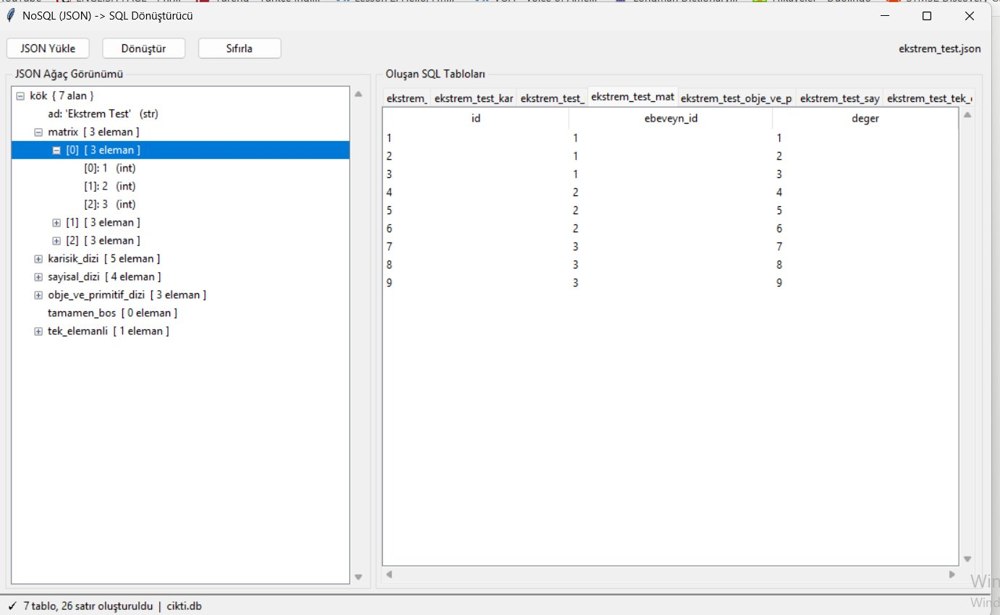
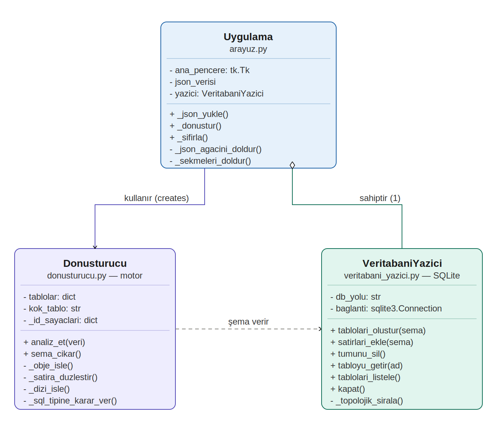
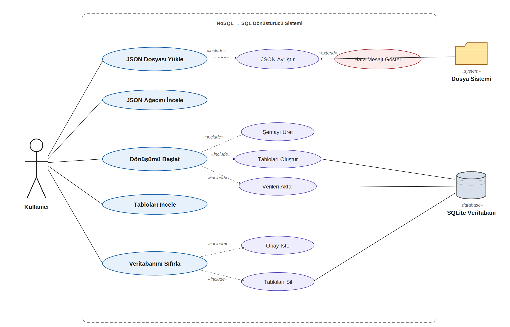

# NoSQL'den SQL'e Dinamik Dönüşüm Sistemi

Yapısı önceden bilinmeyen JSON (NoSQL) belgelerini çalışma zamanında analiz edip otomatik olarak ilişkisel SQLite veritabanına dönüştüren jenerik bir masaüstü uygulaması.

> Kocaeli Üniversitesi — Bilgisayar Mühendisliği
> Programlama Laboratuvarı II — III. Proje



## Özellikler

- **Dinamik şema üretimi:** Tablo adları, sütun adları ve veri tipleri koda yazılmaz (hardcoded değildir), tamamen gelen JSON'dan türetilir.
- **Düzleştirme (Flattening):** İç içe objeler aynı tabloda sütunlara dönüştürülür. Örneğin `"adres": {"sehir": "Kocaeli"}` → `adres_sehir`
- **Otomatik normalizasyon:** Diziler (`[...]`) ayrı alt tablolara bölünür ve ana tabloya Yabancı Anahtar (Foreign Key) ile bağlanır (1:N ilişki).
- **Tip çıkarımı:** Her sütun için uygun SQL tipi (`INTEGER`, `REAL`, `TEXT`) otomatik belirlenir.
- **Güvenli veri aktarımı:** `INSERT INTO` sorguları SQL injection'a karşı parametreli (`?`) çalıştırılır.
- **Grafik arayüz:** JSON ağaç görünümü, sekmeli SQL tablo görünümü ve tüm tabloları silen sıfırlama butonu.

## Normalizasyon

| Form | Tetikleyen | Sistemin yaptığı |
|---|---|---|
| 1NF | Dizi `[...]` | Her eleman alt tabloda ayrı satır olur (atomik değer) |
| 2NF | Her tablo | Otomatik `id` Primary Key, alt tablolarda `ebeveyn_id` Foreign Key |
| 3NF | İç içe obje `{...}` | Hiyerarşik yapılar FK zinciriyle ayrı tablolara bölünür / düzleştirilir |

## Proje Yapısı

```
prolab2proje3/
├── arayuz.py              # Tkinter arayüzü (Uygulama sınıfı) — ana giriş noktası
├── donusturucu.py         # Dönüşüm motoru (Donusturucu sınıfı)
├── veritabani_yazici.py   # SQLite işlemleri (VeritabaniYazici sınıfı)
├── main.py                # Arayüzsüz komut satırı test aracı
├── test_verileri/         # Örnek JSON dosyaları
│   ├── test_data.json
│   ├── zorlu_test.json    # 6 katman derinlik
│   ├── kok_dizi_test.json # Kökü dizi olan JSON
│   └── ekstrem_test.json  # Matris, karışık tipler, boş dizi
└── rapor/                 # IEEE formatında proje raporu
    ├── rapor.pdf
    ├── rapor.tex
    └── figures/
```

## Gereksinimler

- Python **3.10** veya üzeri
- Ek kütüphane gerekmez (`tkinter`, `sqlite3` ve `json` Python ile birlikte gelir)

## Çalıştırma

Arayüz ile:

```bash
python arayuz.py
```

1. **JSON Yükle** ile bir JSON dosyası seçin
2. **Dönüştür** ile tabloları oluşturun
3. **Sıfırla** ile tüm tabloları silin (`DROP TABLE`)

Komut satırından (arayüzsüz):

```bash
python main.py test_verileri/zorlu_test.json
```

Oluşan veritabanı `cikti.db` dosyasına yazılır; [DB Browser for SQLite](https://sqlitebrowser.org/) ile açılarak incelenebilir.

## Test Sonuçları

| Test Dosyası | Tablo | Satır | Test Edilen Özellik |
|---|---|---|---|
| `test_data.json` | 5 | 9 | Temel düzleştirme, dizi |
| `zorlu_test.json` | 7 | 16 | 6 katman derinlik, null |
| `kok_dizi_test.json` | 2 | 6 | Kök dizi, eksik alanlar |
| `ekstrem_test.json` | 7 | 26 | Matris, karışık tip |

## Diyagramlar

| Sınıf Diyagramı | Kullanım Senaryosu Diyagramı |
|---|---|
|  |  |

## Geliştirenler

- Burak Kılcı
- Ömer Faruk Teke
